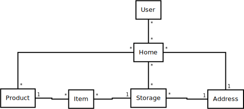

# HomeStorage
Keep track of home storage.

Created for a course named Aineopintojen harjoitustyö: Tietokantasovellus kevät 2019.

Every home has some food stored, whether it's half eaten bread and open can of milk, 3 tons of sugar (https://www.riemurasia.net/kuva/Sokerivarasto/69529), or something between. The home storage can also contain products such as medicine, tools, and so on. The items in home storage often have limited lifetime, they are constantly being used, and the stock is also constantly being replenished with new items. The larger the storage is, the harder it is to keep track of the current state of it; is something going bad soon, is there oversupply of some product, etc.

## Features

This software is aimed to help keep track of the home storage, get reports and alerts about it, and help for replenishing the stock.
* Products

  A *product* is something that can be stored, it's an abstract representation. All the *products* are shared between all the *homes*.
  An *item* is a physical instantation of a *product*, something that is actually present in real life. An *item* is always tied to a specific *storage*.

  Product management handles creating, updating, and deleting of *products*.

* Homes

  A *home* is a set of *storages*.

  Home management contains tools to manage storages belonging to the home, and changing the other attributes of the home.

  Administrators can create new and delete existing homes.

* Storages

  A single *storage* represents a location to store *items*.

  In storage management users can update the stock.

* Reports and alarms
  * Items going bad/old.
  * List of missing products.
  * Product usage statistics.
  
* Users

  Users are categorized into two groups: administrators and normal users.

  Administrators can create normal users, create and delete homes, and also use all the homes.
  Normal users can only use homes they are linked to.
  A home can have multiple normal users linked to it, and normal users can be linked to multiple homes.

## Class diagram

## Heroku app
<a href="https://guarded-reef-23220.herokuapp.com/">Home Storage at Heroku</a>
