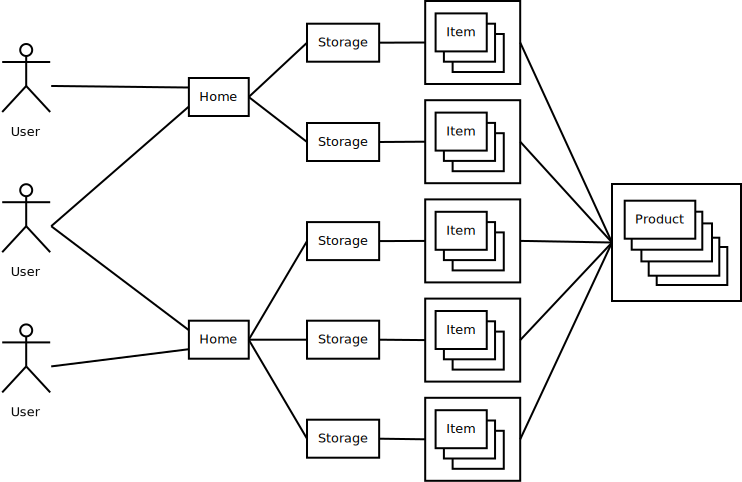

# HomeStorage
Keep track of home storage.

Created for a course named Aineopintojen harjoitustyö: Tietokantasovellus kevät 2019.

## Abstract

Every home has some food stored, whether it's half eaten bread and open can of milk, [3 tons of sugar](https://www.riemurasia.net/kuva/Sokerivarasto/69529), or something between. The home storage can also contain items such as medicine, tools, and so on. The items in home storage often have limited lifetime, they are constantly being used, and the stock is also constantly being replenished with new items. The larger the storage is, the harder it is to keep track of the current state of it; is something going bad soon, is there oversupply of something, and so on.

## Features

This software is aimed to help keep track of the items in your home storages, get reports and alerts about them, and help in replenishing the stock.

The generic view of the software looks like the following:

For more information, see the documentation below.

## Documentation

* [Installation and running](documentation/installation.md)
* [User documentation](documentation/index.md)
* [User stories](documentation/user-stories.md)
* [Class diagram](documentation/classdiagram.svg)
* [Database](documentation/database.md)
* [Missing features and further development](documentation/further-development.md)

Default superuser account login is "root", and its password is "root".

## Heroku app
<a href="https://guarded-reef-23220.herokuapp.com/">Home Storage at Heroku</a>
