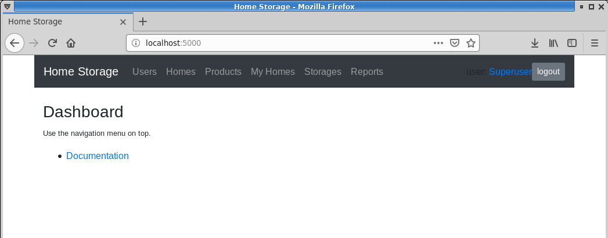
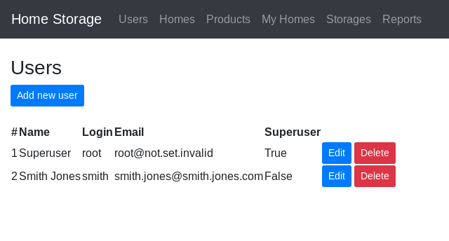
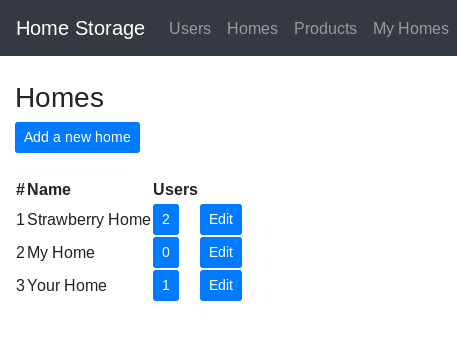
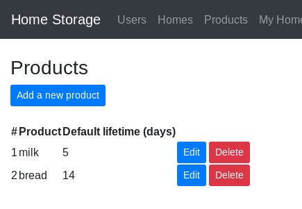
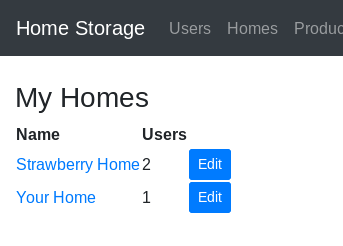
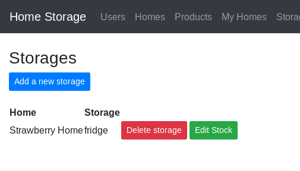
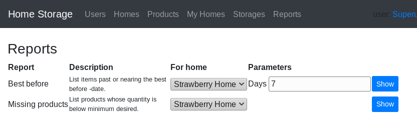

# Home Storage

## 1. Installation

### 1.1. Requirements
*Home Storage* requires Python 3.

### 1.2. Obtaining Home Storage
*Home Storage* can be obtained from the Github [homepage for Home Storage](https://github.com/Peanhua/HomeStorage").

Clone the project, or download the zip file and unpack its contents.

### 1.3. Setup the Python environment
Setup a Python virtual environment using the *venv* Python module:

```$ python3 -m venv venv```

Take the newly created virtual environment into use:

```$ source venv/bin/activate```

Install the Python required Python packages listed in *requirements.txt*:

```$ pip install -r requirements.txt```

### 1.4. Running Home Storage
To run *Home Storage*, use the *run.py* script:

```$ ./run.py```
    
## 2. Setup
After a fresh install, the system contains one default user named *root*, with a default password *root*. The *root* user has admin rights, and it can not be deleted. It is highly advisable to change the default password to something else.

Use the *root* user to create new user accounts and new homes.

    
## 3. Using

### 3.1. User interface
The screen is divided into two main parts. The top part contains a navigation toolbar, access to the users profile, and a button to logout the current user. The bottom part contains the currently active content.



The number of menu entries in the navigation toolbar depends on the user, superusers have access to more options.
    
### 3.2. Users
Users are divided into two groups: those who have admin rights and those who don't.

Users with admin rights, aka *superusers*, can do all the same things as normal users, but in addition the superusers can manage users and homes. The user with user id 1 is a special, and can not be deleted.

User management menu is shown only for superusers, and it contains tools to create new users, edit existing users, and delete existing users.



### 3.3. Homes
From the home management, a superuser can create new homes, edit and delete existing homes.



### 3.4. Products
Products are shared amongst all the homes. They can be created, edited, and deleted from the product management.

The *default lifetime* is used to calculate the best before date.



### 3.5. My Homes
From the *My Homes* management menu, users can see the current total stock of items for their homes, and edit the settings for each of their home.



### 3.6. Storages
A *storage* is a place in a *home* where items are stored. A home can have multiple storages. Storages management menu can be used to create and edit storages. The stock of each storage is managed through the *Edit stock* option.



### 3.7. Reports
There are currently two reports available from the reports menu:
* Best before
* Missing products

From the reports menu, choose the home and other parameters, and then click the *Show* -button to generate a report.



#### 3.7.1. Best before report
Best before report lists items past, or nearing, the best before date of each stored item.

#### 3.7.2. Missing products report
Missing products report lists products whose quantity is below minimum desired defined for the home.

