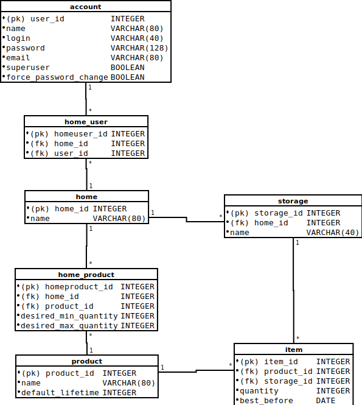

# Database

Database diagram:


## Indices

<table>
  <tr><th>Index name                </th><th>Index type</th><th>Table       </th><th>Fields    </th></tr>
  <tr><td>ix_account_login          </td><td>unique    </td><td>account     </td><td>login     </td></tr>
  <tr><td>ix_home_product_home_id   </td><td>index     </td><td>home_product</td><td>home_id   </td></tr>
  <tr><td>ix_home_product_product_id</td><td>index     </td><td>home_product</td><td>product_id</td></tr>
  <tr><td>ix_home_user_home_id      </td><td>index     </td><td>home_user   </td><td>home_id   </td></tr>
  <tr><td>ix_home_user_user_id      </td><td>index     </td><td>home_user   </td><td>user_id   </td></tr>
  <tr><td>ix_item_product_id        </td><td>index     </td><td>item        </td><td>product_id</td></tr>
  <tr><td>ix_item_storage_id        </td><td>index     </td><td>item        </td><td>storage_id</td></tr>
  <tr><td>ix_storage_home_id        </td><td>index     </td><td>storage     </td><td>home_id   </td></tr>
</table>


## Create table SQL
```SQL
CREATE TABLE product (
        product_id       INTEGER NOT NULL, 
        name             VARCHAR(80) NOT NULL, 
        default_lifetime INTEGER NOT NULL, 
        PRIMARY KEY (product_id)
);

CREATE TABLE home (
        home_id INTEGER NOT NULL, 
        name    VARCHAR(80) NOT NULL, 
        PRIMARY KEY (home_id)
);

CREATE TABLE account (
        user_id               INTEGER NOT NULL, 
        name                  VARCHAR(80) NOT NULL, 
        login                 VARCHAR(40) NOT NULL, 
        password              VARCHAR(128) NOT NULL, 
        email                 VARCHAR(80) NOT NULL, 
        superuser             BOOLEAN NOT NULL, 
        force_password_change BOOLEAN NOT NULL, 
        PRIMARY KEY (user_id), 
        UNIQUE (login), 
        CHECK (superuser IN (0, 1)), 
        CHECK (force_password_change IN (0, 1))
);

CREATE TABLE home_user (
        homeuser_id INTEGER NOT NULL, 
        home_id     INTEGER NOT NULL, 
        user_id     INTEGER NOT NULL, 
        PRIMARY KEY (homeuser_id), 
        FOREIGN KEY(home_id) REFERENCES home (home_id)    ON DELETE CASCADE, 
        FOREIGN KEY(user_id) REFERENCES account (user_id) ON DELETE CASCADE
);

CREATE TABLE home_product (
        homeproduct_id       INTEGER NOT NULL, 
        home_id              INTEGER NOT NULL, 
        product_id           INTEGER NOT NULL, 
        desired_min_quantity INTEGER, 
        desired_max_quantity INTEGER, 
        PRIMARY KEY (homeproduct_id), 
        FOREIGN KEY(home_id)    REFERENCES home (home_id)       ON DELETE CASCADE, 
        FOREIGN KEY(product_id) REFERENCES product (product_id) ON DELETE CASCADE
);

CREATE TABLE storage (
        storage_id INTEGER NOT NULL, 
        home_id    INTEGER NOT NULL, 
        name       VARCHAR(80) NOT NULL, 
        PRIMARY KEY (storage_id), 
        FOREIGN KEY(home_id) REFERENCES home (home_id) ON DELETE CASCADE
);

CREATE TABLE item (
        item_id     INTEGER NOT NULL, 
        product_id  INTEGER NOT NULL, 
        storage_id  INTEGER NOT NULL, 
        quantity    INTEGER NOT NULL, 
        best_before DATE NOT NULL, 
        PRIMARY KEY (item_id), 
        FOREIGN KEY(product_id) REFERENCES product (product_id), 
        FOREIGN KEY(storage_id) REFERENCES storage (storage_id) ON DELETE CASCADE
);
```

## Default data inserts
```SQL
INSERT INTO account (name, login, password, email, superuser, force_password_change)
             VALUES ('Superuser', 'root', '$2b$12$ZLRQf/zxUaah4PbweKKRH.qUxYtdvj0BmdrqHsQSgrSHpL6FfX9ZG', 'root@not.set.invalid', 1, 0);
```
