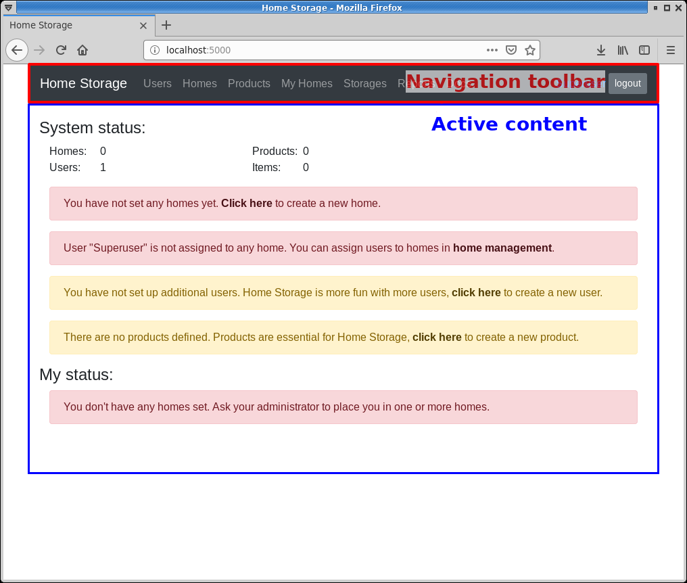
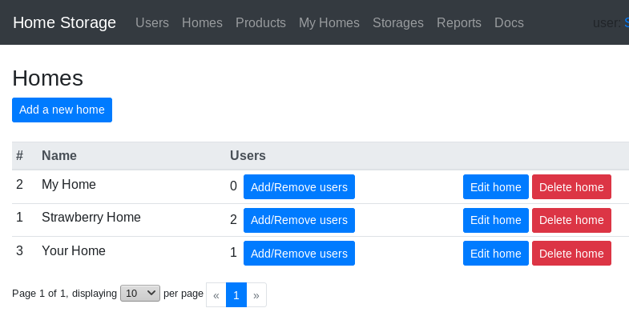
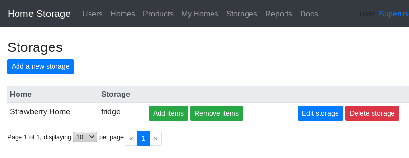
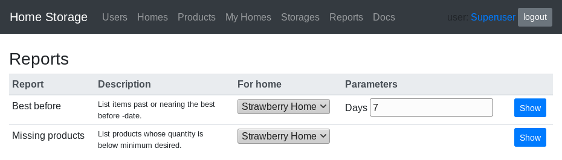

# Home Storage

## 0. Abstract

Every home has some food stored, whether it's half eaten bread and open can of milk, [3 tons of sugar](https://www.riemurasia.net/kuva/Sokerivarasto/69529), or something between. The home storage can also contain items such as medicine, tools, and so on. The items in home storage often have limited lifetime, they are constantly being used, and the stock is also constantly being replenished with new items. The larger the storage is, the harder it is to keep track of the current state of it; is something going bad soon, is there oversupply of something, and so on.

This software is aimed to help keep track of the home storage, get reports and alerts about it, and help in replenishing the stock.

## 1. Setup
After a fresh install, the system contains one default user named *root*, with a default password *root*. The *root* user has admin rights, and it can not be deleted. It is highly advisable to change the default password to something else.

Use the *root* user to create new user accounts and new homes.

## 2. Using

### 2.1. User interface
The screen is divided into two main parts. The top part contains a navigation toolbar, access to the users profile, and a button to logout the current user. The bottom part contains the currently active content.

The number of menu entries in the navigation toolbar depends on the user: superusers have access to more options.

### 2.2. Users
Users are divided into two groups: those who have admin rights and those who don't.

Users with admin rights, aka *superusers*, can do all the same things as normal users, but in addition the superusers can manage users and homes. The user with user id 1 is a special, and can not be deleted. After a fresh install, the system contains one default superuser named *root*, with a default password *root*.

User management menu is shown only for superusers, and it contains tools to create new users, edit existing users, and delete existing users.

### 2.3. Homes
A *home* is a set of *storages*, *users*, and *product* settings.

The home management menu is shown only for superusers, from there, a superuser can create new homes, edit and delete existing homes.

### 2.4. Products
A *product* is something that can be stored, it's an abstract representation. All the *products* are shared between all the *homes*.

An *item* is a physical instantation of a *product*, something that is actually present in real life. An *item* is always located in a specific *storage*.

Products are shared amongst all the homes. They can be created, edited, and deleted from the product management.

The *default lifetime* is used to calculate the best before date.

### 2.5. My Homes
From the *My Homes* management menu, users can see the current total stock of items for their homes, and edit the settings for each of their home.

### 2.6. Storages
A *storage* is a place in a *home* where items are stored. A home can have multiple storages. Storages management menu can be used to create and edit storages. The stock of each storage is managed through the *Add items* and the *Remove items* options.

### 2.7. Reports
There are currently two reports available from the reports menu:
* Best before
* Missing products

From the reports menu, choose the home and other parameters, and then click the *Show* -button to generate a report.

#### 2.7.1. Best before report
Best before report lists items past, or nearing, the best before date of each stored item.

#### 2.7.2. Missing products report
Missing products report lists products whose quantity is below minimum desired defined for the home.

